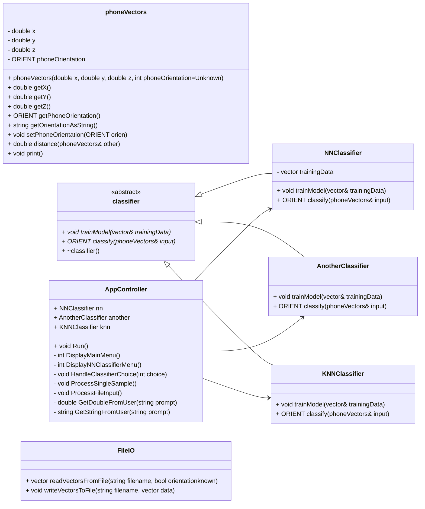

```mermaid
classDiagram
    direction LR

    class phoneVectors {
        - double x
        - double y
        - double z
        - ORIENT phoneOrientation
        + phoneVectors(double x, double y, double z, int phoneOrientation=Unknown)
        + double getX()
        + double getY()
        + double getZ()
        + ORIENT getPhoneOrientation()
        + string getOrientationAsString()
        + void setPhoneOrientation(ORIENT orien)
        + double distance(phoneVectors& other)
        + void print()
    }

    class classifier {
        <<abstract>>
        + void trainModel(vector<phoneVectors>& trainingData)*
        + ORIENT classify(phoneVectors& input)*
        + ~classifier()
    }

    class NNClassifier {
        - vector<phoneVectors> trainingData
        + void trainModel(vector<phoneVectors>& trainingData)
        + ORIENT classify(phoneVectors& input)
    }

    class AnotherClassifier {
        + void trainModel(vector<phoneVectors>& trainingData)
        + ORIENT classify(phoneVectors& input)
    }

    class KNNClassifier {
        + void trainModel(vector<phoneVectors>& trainingData)
        + ORIENT classify(phoneVectors& input)
    }

    class AppController {
        + void Run()
        + NNClassifier nn
        + AnotherClassifier another
        + KNNClassifier knn
        - int DisplayMainMenu()
        - int DisplayNNClassifierMenu()
        - void HandleClassifierChoice(int choice)
        - void ProcessSingleSample()
        - void ProcessFileInput()
        - double GetDoubleFromUser(string prompt)
        - string GetStringFromUser(string prompt)
    }

    class FileIO {
        + vector<phoneVectors> readVectorsFromFile(string filename, bool orientationknown)
        + void writeVectorsToFile(string filename, vector<phoneVectors> data)
    }

   
    classifier <|-- NNClassifier
    classifier <|-- AnotherClassifier
    classifier <|-- KNNClassifier

    AppController --> NNClassifier
    AppController --> AnotherClassifier
    AppController --> KNNClassifier
```

    classifier --> phoneVectors
    NNClassifier --> phoneVectors

    FileIO --> phoneVectors
    AppController --> FileIO
